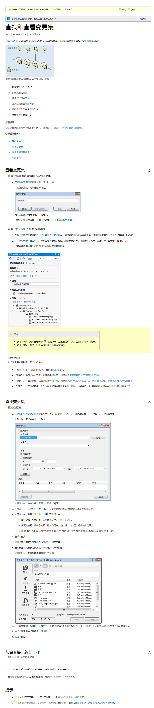

## tfs 查找自己的所有更改
 1. 找到团队资源管理器Tab页面，点击源代码管理器然后就会打开源代码管理器的Tab页面。

 2. 让新打开的Tab获取焦点，然后按Ctrl+G 出现下面的界面

 3. 点击查找 出现下面的界面

 4. 输入自己的查询条件就可以显示自己的更改。
 

[参考地址（点击）](https://msdn.microsoft.com/zh-cn/library/ms181408.aspx)