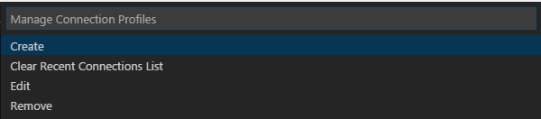

# VsCode 操作MS SQL Server

## 1. 电脑安装Vs Code
## 2. 安装MSSQL插件 
### 1. 点击左侧工具栏的插件按钮，在检索框检索'MSSQL'安装查询到的插件
### 2. 或者Ctrl+Shift+p 输入'extinstall' 回车也可以调出扩展安装功能按上面的方法操作。

## 3. 命令介绍
安装完成后 按Ctrl+Shift+p输入'sql' 会有提示所有的命令
1. Cancel Query //退出当前的查询命令
2. Connect //链接数据库
3. Disconnect // 关闭数据库连接
4. Execute Query // 执行sql查询
5. Getting Started Guide // 打开指导文档
6. Manage Connection Profiles //管理链接配置
7. Use DataBase //切换数据库

## 4. 下面按照正常使用数据库的过程来说明
首先打开VsCode，Ctrl+n 创建一个新的文件，在右下角会有一个选择文件类型的选项（默认是纯文本），点击后会提示所有可以选择的文件类型，选择.sql文件类型。或者你直接将文件保存为.sql文件，VsCode会自动检测文件类型。
> 点击纯文本就可以选择文件类型

### 1. 链接数据库（使用 Connect命令）
 1. 还是按 Ctrl+Shift+p 输入sql 会在输入框下面出现命令提示，按上下键切换到Connect选项，回车（如果当前的文本类型不是SQL会提示选择文本类型）
> 设置文本类型

 2. 默认没有配置链接的话会提示创建数据库连接(Create Connection Prfile)，否则会有以前的链接记录，直接选中以前的链接，回车，然后会提示输入密码，输入后密码后回车即可。如果选中的是创建新的连接那么就会提示输入连接地址，输入后回车，（我在本地win7上测试的直接输入localhost或.,然后回车）
 > 选择创建连接

> 输入用户名

 
 3. 会提示输入要连接的数据库名称，输入后回车
> 输入数据库名称

 4. 接下来会提示选择连接类型，我选择的是 SQL Login,另一中是使用类似managementStudio中的Windows登录的方式。
> 输入数据库名称

 5. 接下来会提示输入用户名，
> 输入用户名

 6. 接下来会提示输入密码，
> 输入用户名

 7. 接下来会提示是否保存密码，选择Yes或者No都会提示会再提示输入一个名称，可以不输入，直接回车就行。然后会提示链接成功。
> 选择Yes或No

输入一个名称

链接成功

8. 如果想关闭连接直接Ctrl+Shift+p 输入sql 选择DisConnect，回车即可。

## 5. 执行查询命令
直接在tab页面中输入查询语句，Ctrl+Shift+e 就可以运行，当然也可以在 Ctrl+Shift+p 输入sql 选择Execute Query，（可以同时执行多条查询语句，如果有选中行的话那就执行选中的语句）
在查询结果中有查询结果和时间，在右侧有将查询结果导出成csv或者json的帮助按钮。按照提示操作就可以将结果导出到文件。
>执行查询

## 6. 修改配置
可以创建、清除、编辑、移除链接记录，使用编辑功能可以直接编辑配置文件，其他按照说明操作也可以编辑链接配置。

系统目录是由描述SQL Server 系统的数据库、基表、视图和索引等对象的结构的系统表组成。SQL Server 经常访问系统目录，检索系统正常运行所需的必要信息。 
1. Sysobjects表  
                      SQL Server 的主系统表sysobjects出现在每个数据库中，它对每个数据库对象含有一行记录。

2. Syscolumns表 
                          系统表syscolumns出现在master数据库和每个用户自定义的数据库中，它对基表或者视图的每个列和存储过程中的每个参数含有一行记录。 
3. Sysindexes表 
                          系统表sysindexes出现在master数据库和每个用户自定义的数据库中，它对每个索引和没有聚簇索引的每个表含有一行记录，它还对包括文本/图像数据的每个表含有一行记录。 
4. Sysusers表 
                        系统表sysusers出现在master数据库和每个用户自定义的数据库中，它对整个数据库中的每个Windows NT用户、Windows NT用户组、SQL Server 用户或者SQL Server 角色含有一行记录。 
5. Sysdatabases表 
                      系统表sysdatabases对SQL Server 系统上的每个系统数据库和用户自定义的数据库含有一行记录，它只出现在master数据库中。 
6. Sysdepends表 
                      系统表Sysdepends对表、视图和存储过程之间的每个依赖关系含有一行记录，它出现在master数据库和每个用户自定义的数据库中。 
7. Sysconstraints表 
                          系统表sysconstraints对使用CREATE TABLE或者ALTER TABLE语句为数据库对象定义的每个完整性约束含有一行记录，它出现在master数据库和每个用户自定义的数据库中。 
8.sys.tables 
                       显示出当前数据库中的所有的表对象 
9.sys.columns 
                     显示当前数据表中所有列 
10.sys.types 
                         显示当前数据库中的说有字段类型

                         